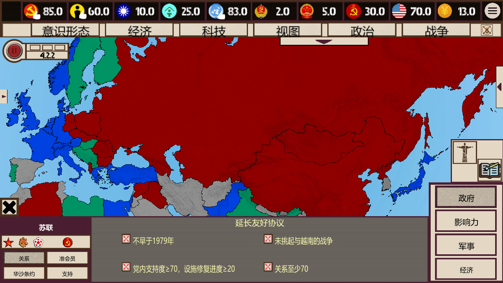
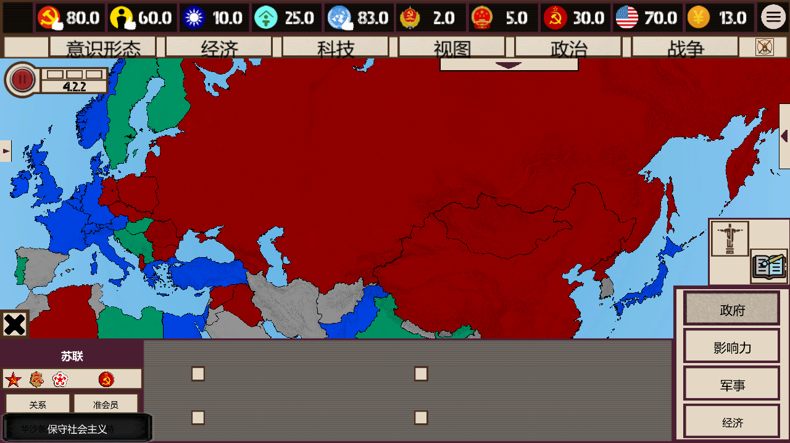
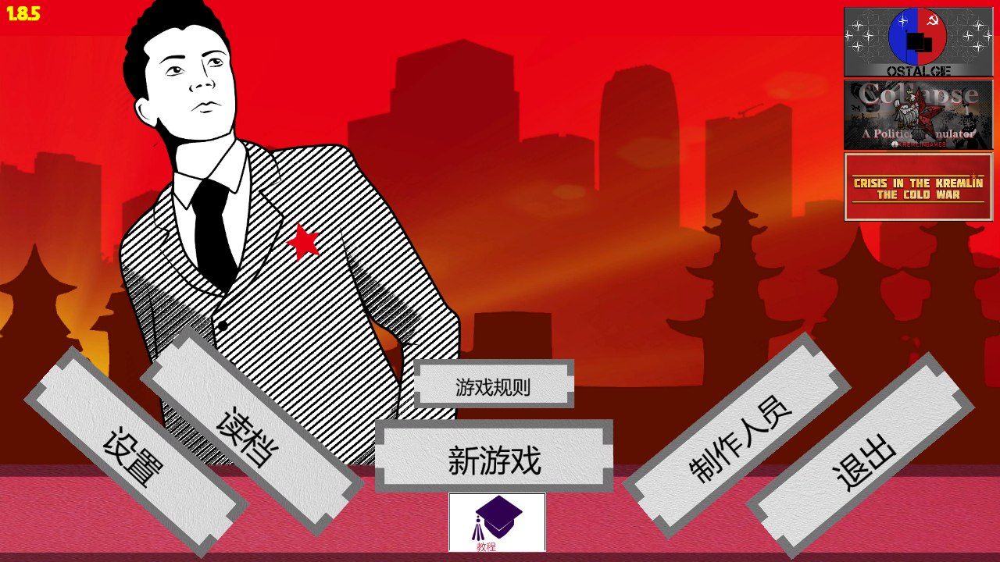
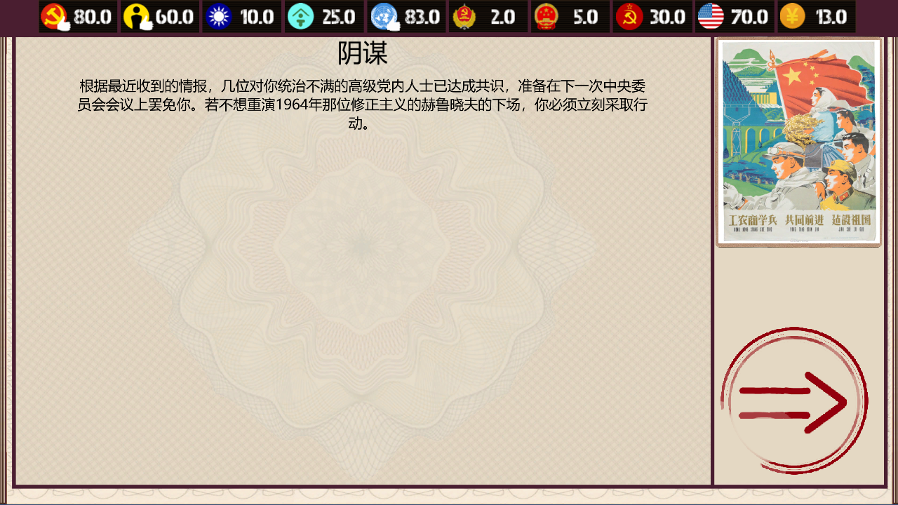
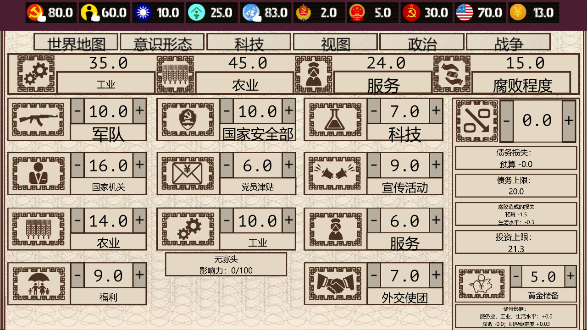
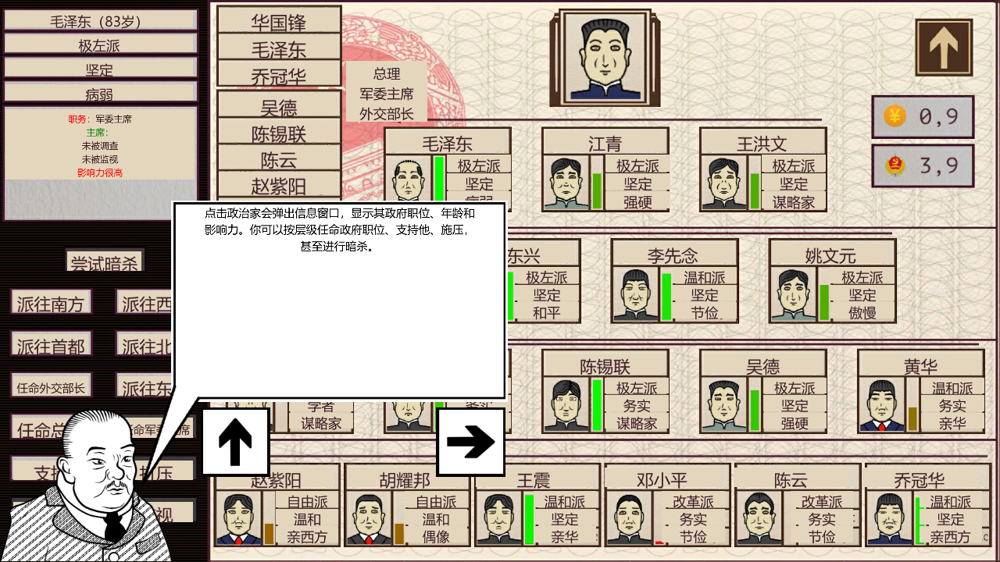

# 《毛泽东的遗产》完全汉化（1.8.5）

中文字体、文本框换行与缩放、遗漏文本补译、教程图中文字覆盖。适用于 Windows Steam 版 **Mao's Legacy 1.8.5**。

**如有纰漏，请在评论中反馈。** 请在[汉化问题反馈帖](https://github.com/Clukay-416/Mao-s-Legacy-Full-Chinese/issues/1)评论，或[新建 Issue](https://github.com/Clukay-416/Mao-s-Legacy-Full-Chinese/issues/new)，附上游戏版本、出现问题的页面、操作步骤和截图。

## zh.3 修正与覆盖复查

- 根据中文攻略、玩家讨论和旧汉化作者说明，整理75项术语建议。数值资源采用“特勤点数”，统一“国际声望”“思想自由化”“极左派”等；组织和人物叙事分别保留合适名称。
- 修复经济页储备标题被省略、中文多行字拥挤、切换场景或克隆对象后字号重复缩小。保留标题、条件、数值和原有点击范围。
- 补译派系合作与人物窗口按钮的拼写变体，修复双空格人名；校正土耳其结果错配、反官僚主义人物说明被译反、齐奥塞斯库错名等，并恢复颜色标注。
- 相对zh.2修正280条已有显示映射、新增20个显示键、修正146行文本资源；现有7,605条显示映射及4,419行资源。变更见`Source/zh3_review_log.json`。
- 28个同状态界面对照未发现原有动作组件丢失或点击范围变化；86个当前地图国家标题切换、2,536个译文汉字字形检查通过。统计按观察路径归并，不表示所有剧情分支均已测试。
- 支持原版、zh.1、zh.2升级；保留原版备份与升级失败回滚。完整的资料、术语和覆盖范围见[检查报告](检查报告/覆盖与界面检查报告.md)。

## zh.2 修复与译校（历史版本）

- 修复外交国家名显示方框：系统动态字体无法直接创建游戏内 TMP 字体，现在保留原 TMP 文字组件和数据，通过兼容显示层绘制中文，并按原文本框对齐、换行和缩放。
- 修复黑底悬浮提示中文字对比度和渲染顺序，保证文字位于背景之上。
- 对全库 7,585 条显示词条和 4,419 行资源做术语检查；修正 416 条显示词条、258 行资源译文。统一特工网络、外交声望、思想解放、职业军队等用语，修正十世班禅、赛福鼎、包尔汉等姓名，补回遗漏的数值效果。逐条变更见 `Source/review_log.json`。
- 当前新游戏地图中 86 个国家的标题切换未发现缺字或空标题；外交按钮悬停说明和条件已复核，2,535 个汉字的系统字体字形检查通过。
- 支持从 zh.1 直接升级，仍使用校验通过的原版备份；升级失败会恢复升级前的文件。

原版点击国家后会先清空操作说明和条件栏；鼠标移到左下方外交按钮上才显示对应说明。图标说明同样需要悬停。

本次是全库术语统一和重点界面润色，仍未完成全部剧情逐段人工精校。历史及架空剧情中的称谓按原作语境保留。

## 引用与修改说明

本项目基于 **LeXwDeX** 的 [Mao-s-Legacy-Chinese-Tools](https://github.com/LeXwDeX/Mao-s-Legacy-Chinese-Tools) **引用并修改**，沿用其中文翻译基础，补充遗漏译文，并重新实现适配当前游戏文件的显示层、字体、排版、教程图片文字覆盖及差分安装器。感谢原作者及原项目贡献者。

原项目与游戏素材的权利归各自权利人所有；本项目的署名不表示原作者参与本次修改或提供担保。详细来源见 [NOTICE.md](NOTICE.md)。

## 下载与安装

1. 从[下载汉化包](https://github.com/Clukay-416/Mao-s-Legacy-Full-Chinese/raw/refs/heads/main/Downloads/MaoChinese-Public-1.8.5-zh.3.zip)下载 **MaoChinese-Public-1.8.5-zh.3.zip**，完整解压。
2. 关闭游戏，双击 **Install.cmd**。安装器会尝试定位 Steam 游戏目录；无法定位时，请输入包含 `China.exe` 的目录。
3. 成功后，从 Steam 正常启动游戏。补丁自动选择对应的中文显示资源。

若需手动指定游戏目录，在解压目录打开 PowerShell：

```powershell
powershell.exe -NoProfile -ExecutionPolicy Bypass -File .\Install.ps1 -GameRoot "D:\SteamLibrary\steamapps\common\Mao's Legacy"
```

安装器校验原版及补丁的 SHA-256，将原文件备份至游戏目录的 `.MaoChineseBackup`，然后应用差分补丁。版本或现有修改不兼容时会停止。卸载时关闭游戏，双击 **Uninstall.cmd**；如果游戏不在默认目录，使用 `Uninstall.ps1 -GameRoot "游戏目录"`。卸载保留备份。

只有 `resources.assets`、`Assembly-CSharp.dll`、`NewResolutionDialog.dll` 被修改，另新增 `MaoChinese.dll`。存档、Steam 配置和 DLC 所有权不受修改。公开包以差分形式提供三个原有文件的修改，安装需要玩家自己的对应原版游戏。

## 汉化内容

- 23 份文本资源、4,419 行，保留游戏解析标记和内部键。
- 7,605 条显示翻译映射，补充国家、人名、组织、按钮、政策及事件文本。
- 系统微软雅黑字体，黑体及宋体后备；已核对译文使用的 2,536 个汉字均有字形。
- 15 个显示换行函数接入中文宽度计算，先翻译再换行，保留颜色标签；根据背景框、锚点及尺寸收缩长文本。
- 普通界面、提示框、事件选项与结果页、分辨率窗口接入中文显示。
- 教程截图按钮文字及部分 DLC 宣传图标题使用游戏内中文覆盖层；旗帜、人物、符号和历史海报保持原画。

## 实测与已知范围

已在独立游戏副本中验证新游戏初始化，以及主菜单、地图、政治、经济、科技、统计、战争、设置、规则、存读档、决策、事件长文、选项和结果页。教程全部 31 段已逐步检查。国策与结构化事件经过原版解析器验证；安装、重复安装、卸载及原文件恢复均经过校验。

**“完全汉化”是本项目的发布名称与覆盖目标，不代表所有分支均已百分之百验证。** 所有剧情分支、结局、全部 DLC 所有权组合和联机流程尚未逐一测试，也没有完成逐段专业译校。极窄文本框可能缩小字号；不同分辨率和剧情仍可能有需要修正的遗漏或排版。

Steam 更新或验证文件可能覆盖补丁；更新后应重新核对版本。联机兼容性尚未实测，联机玩家建议使用同版本补丁。

## 游戏实测截图













其余截图见 [预览](预览/)。

## 源码与维护

`Source/` 提供显示层、教程覆盖层、程序集注入器、差分工具、显示词典、资源逐行译文及校验记录。修改 `Source/translations.json`、`Source/supplement.json` 或 `Source/textassets.json` 时，请同步相关显示词条与资源译文，并保留格式占位符、颜色标签和内部键。

重建方法见 [BUILD.md](BUILD.md)。发布版本：`v1.8.5-zh.3`，制作日期：2026-10-06。
